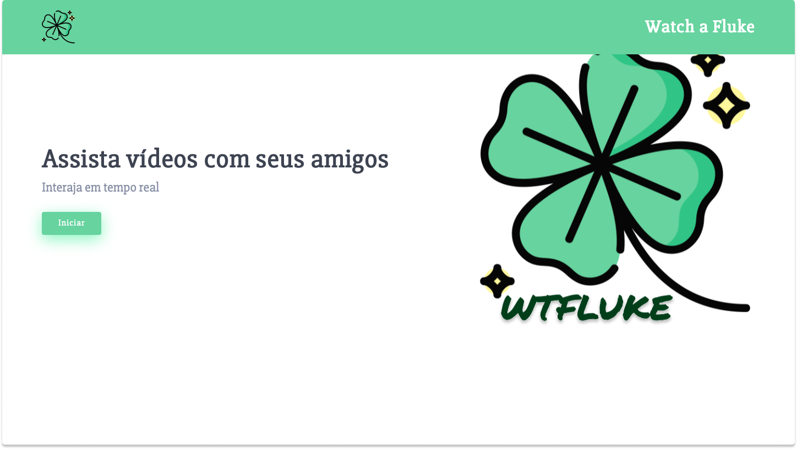

# watch-a-fluke




> O WTFLUKE é uma plataforma de streaming onde você e seus amigos podem assistir vídeos sincronizados enquanto registram suas reações e opniões.

## 💻 Acessando o website
O projeto está hospedado no heroku e você pode ter acesso [clicando aqui.](https://watch-a-fluke.herokuapp.com/index.html)

## 🔧 Tecnologias e ferramentas utilizadas
### FRONT-END
- HTML
- CSS3
- JAVASCRIPT
- BOOTSTRAP

### BACK-END
- NODE.JS
- EXPRESS.JS

## Você vai precisar :
- NPM
- NodeJS [Baixe aqui.](https://nodejs.org/en/download/)

## 🚀 Executando o projeto

```
#### Clone o repositório
git clone https://github.com/CaioKenedy/watch-a-fluke

#### Abra na sua IDE favorita

### Instale as dependências
npm install

### Execute o servidor
npm start

### Agora vá até seu localhost:3000
```


[⬆ Voltar ao topo](#watch-a-fluke)<br>

